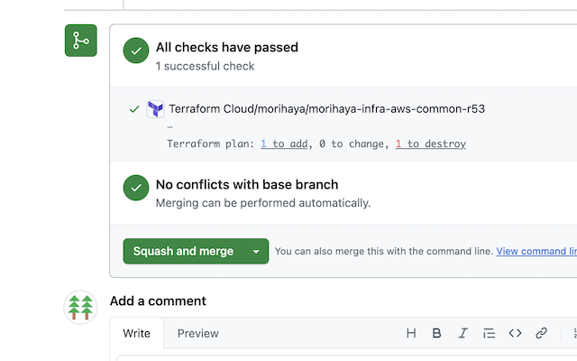

# GitHub HCP Terraform Plan Formatter

A Chrome/Edge extension that formats HCP Terraform (formerly Terraform Cloud) results on GitHub Pull Request pages, making them cleaner and more readable.

## 📸 Screenshots

### Enhanced Display


HCP Terraform plan results with enhanced formatting

### Clean Organization Display



Long organization prefixes are automatically cleaned for better readability

### Color-Coded Results


Plan results with visual color coding for add/change/destroy operations

## ✨ Features

### 🔧 Clean Organization Prefixes

Automatically removes long organization/project prefixes:

```text
Before: Terraform Cloud/my-org-name/my-workspace-name
After:  my-workspace-name
```

### 🎨 Color-Coded Plan Results

Displays Terraform plan results in a clean 2-line layout with visual highlights:

```text
my-workspace-name
Terraform plan: 1 to add, 0 to change, 1 to destroy
```

- **Add**: Blue color with underline for non-zero values
- **Change**: Orange color with underline for non-zero values
- **Destroy**: Red color with underline for non-zero values
- **Zero values**: Default styling

### ⚡ Automatic Operation

- Works automatically on GitHub PR pages
- Supports page navigation and dynamic content loading
- Compatible with both Chrome and Edge browsers
- Works with GitHub Enterprise (EMU) environments

### 🔔 Activity Badge

- Shows processing count on extension icon
- Green badge indicates successful operation
- Tooltip displays detailed information
- Auto-clears on page navigation

## 🚀 Installation

### Developer Mode Installation

1. Open Chrome or Edge browser
2. Navigate to extensions page:
   - Chrome: `chrome://extensions/`
   - Edge: `edge://extensions/`
3. Enable "Developer mode"
4. Click "Load unpacked" (Chrome) or "Load unpacked extension" (Edge)
5. Select this folder

## 📁 File Structure

```text
.
├── manifest.json    # Extension configuration (Manifest V3)
├── content.js       # Main script with DOM manipulation
├── background.js    # Service worker for badge management
├── style.css        # Styling for color-coded results
├── README.md        # This file
└── CLAUDE.md        # Development documentation
```

## 🔧 Technical Specifications

- **Manifest Version**: 3 (latest Chrome extension standard)
- **Permissions**: `activeTab`, `tabs`, `*://github.com/*`
- **Service Worker**: Background script for badge management
- **Execution**: `document_idle` for optimal performance
- **Compatibility**: GitHub SPA navigation, MutationObserver
- **Duplicate Prevention**: `data-terraform-formatted` attribute marking

## ✅ Testing

1. Install the extension using the steps above
2. Navigate to a GitHub PR page with HCP Terraform results
3. Verify that long organization prefixes are removed
4. Check that plan results show in clean 2-line format with colors
5. Confirm that extension badge shows processing count
6. Test navigation between different PR pages

## 🎯 Target Pages

- GitHub Pull Request pages: `https://github.com/*/pull/*`
- Pages with HCP Terraform (formerly Terraform Cloud) check results
- Compatible with GitHub Enterprise environments

## 🙏 Acknowledgments

Special thanks to [github-web-cosmetic](https://github.com/officel/github-web-cosmetic) for providing the foundational approach and techniques that made this extension possible. The robust DOM manipulation patterns and GitHub SPA navigation handling were instrumental in creating a stable and reliable solution.

## 📝 Version History

- **v1.0.1**: Badge feature update with activity indicator
- **v1.0.0**: Initial release with core formatting features
- Prefix removal for cleaner workspace names
- Color-coded plan results with visual highlighting
- Robust SPA navigation support
